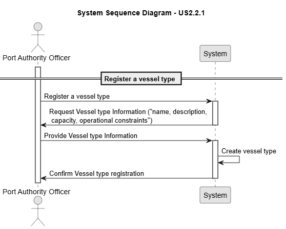
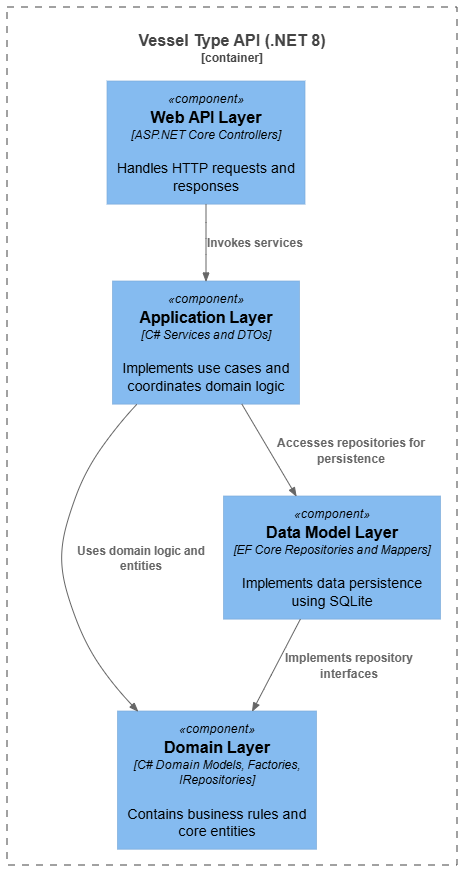
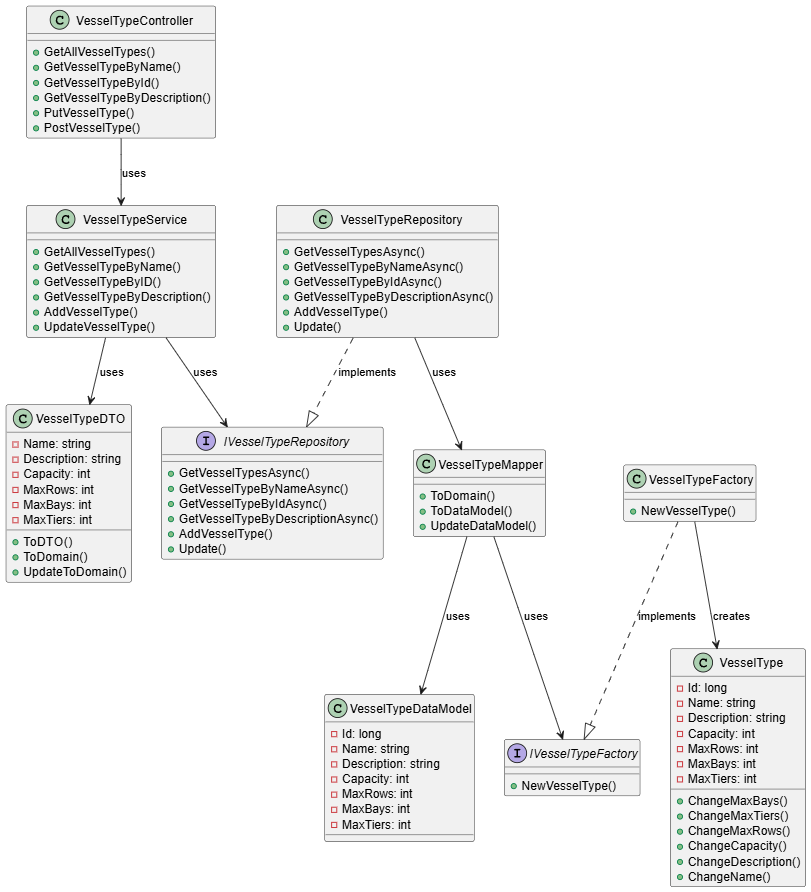
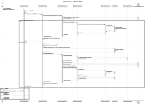
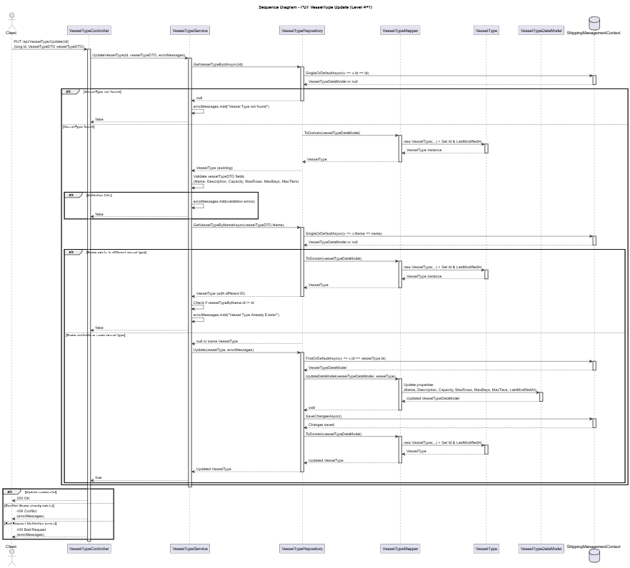

# US 2.2.1

## 1. Context

*As a Port Authority Officer, I want to create and update vessel types, so that vessels can be classified consistently and their operational constraints are properly defined.*

## 2. Requirements

**US 2.2.1** As a Port Authority Officer, I want to create and update vessel types.

**Acceptance Criteria:**

- Vessel types must include attributes such as name, description, capacity, and operational constraints (e.g.: maximum number of rows, bays, and tiers).

- Vessel types must be available for reference when registering vessel records.

- Vessel types must be searchable and filterable by name and description.


**Dependencies/References:**

*There no dependecies.*


**Forum Insight:**

* No clarifications worth mention from the forum.

## 3. Analysis

Vessel type Registration



## 4. C4 Model

#### Context - Level 1


#### Containers - Level 2


#### Components - Level 3



#### Code - Level 4



#### Level +1

##### Vessel Type POST


##### Vessel Type UPDATE



## 5. Integration Tests

### Tests Related to Post

```csharp
        [Fact]
        public async Task PostVesselType_ThenGetByName_ReturnsCreatedAndOk()
        {
            var dto = new VesselTypeDTO
            {
                Name = "TestType",
                Description = "TestDesc",
                Capacity = 100,
                MaxRows = 10,
                MaxBays = 5,
                MaxTiers = 3
            };
            var postResponse = await _client.PostAsJsonAsync("/api/VesselType", dto);
            Assert.Equal(HttpStatusCode.Created, postResponse.StatusCode);

            var getResponse = await _client.GetAsync($"/api/VesselType/ByName/{dto.Name}");
            Assert.Equal(HttpStatusCode.OK, getResponse.StatusCode);
            var returned = await getResponse.Content.ReadFromJsonAsync<VesselTypeDTO>();
            Assert.NotNull(returned);
            Assert.Equal(dto.Name, returned.Name);
        }

                [Theory]
        [InlineData("NegativeType1", "Desc", -100, 5, 5, 3)]
        [InlineData("NegativeType2", "Desc", 100, -10, 5, 3)]
        [InlineData("NegativeType3", "Desc", 100, 5, -5, 3)]
        [InlineData("NegativeType4", "Desc", 100, 5, 5, -3)]
        public async Task PostVesselType_NegativeNumbers_ReturnsBadRequest(string name, string description, int capacity, int maxRows, int maxBays, int maxTiers)
        {
            var dto = new VesselTypeDTO
            {
                Name = name,
                Description = description,
                Capacity = capacity,
                MaxRows = maxRows,
                MaxBays = maxBays,
                MaxTiers = maxTiers
            };
            var postResponse = await _client.PostAsJsonAsync("/api/VesselType", dto);
            Assert.Equal(HttpStatusCode.BadRequest, postResponse.StatusCode);
        }

```

### Tests Related to Update


```csharp

        [Theory]
        [InlineData("UpdateName", "UpdatedDesc", 500, 50, 25, 15)]
        [InlineData("AnotherUpdate", "AnotherDesc", 600, 60, 30, 18)]
        public async Task PutVesselType_UpdatesSuccessfully(string name, string description, int capacity, int maxRows, int maxBays, int maxTiers)
        {
            var response = await _client.GetAsync("/api/VesselType/ByName/Teste1");
            var vesselType = await response.Content.ReadFromJsonAsync<VesselTypeDTO>();
            Assert.NotNull(vesselType);
            Assert.Equal("Teste1", vesselType.Name);

            vesselType.Name = name;
            vesselType.Description = description;
            vesselType.Capacity = capacity;
            vesselType.MaxRows = maxRows;
            vesselType.MaxBays = maxBays;
            vesselType.MaxTiers = maxTiers;

            var putResponse = await _client.PutAsJsonAsync($"/api/VesselType/Update/{vesselType.Id}", vesselType);
            Assert.Equal(HttpStatusCode.OK, putResponse.StatusCode);

            var getResponse = await _client.GetAsync($"/api/VesselType/ByName/{vesselType.Name}");
            var returned = await getResponse.Content.ReadFromJsonAsync<VesselTypeDTO>();
            Assert.NotNull(returned);
            Assert.Equal(description, returned.Description);
            Assert.Equal(capacity, returned.Capacity);
            Assert.Equal(maxRows, returned.MaxRows);
            Assert.Equal(maxBays, returned.MaxBays);
            Assert.Equal(maxTiers, returned.MaxTiers);
        }


        [Theory]
        [InlineData("Teste1", "Desc", -100, 10, 5, 3)]
        [InlineData("Teste2", "Desc", 100, -10, 5, 3)]
        [InlineData("Teste3", "Desc", 200, 20, -10, 6)]
        [InlineData("Teste1", "Desc", 300, 30, 15, -9)]
        [InlineData("Teste2", "Desc", 400, -30, -15, -9)]
        public async Task PutVesselType_UpdateNegativeNumbers_ReturnsBadRequest(string name, string description, int capacity, int maxRows, int maxBays, int maxTiers)
        {
            var response = await _client.GetAsync("/api/VesselType/ByName/Teste1");
            var vesselType = await response.Content.ReadFromJsonAsync<VesselTypeDTO>();
            Assert.NotNull(vesselType);
            Assert.Equal("Teste1", vesselType.Name);

            vesselType.Name = name;
            vesselType.Description = description;
            vesselType.Capacity = capacity;
            vesselType.MaxRows = maxRows;
            vesselType.MaxBays = maxBays;
            vesselType.MaxTiers = maxTiers;
            var putResponse = await _client.PutAsJsonAsync($"/api/VesselType/Update/{vesselType.Id}", vesselType);
            Assert.Equal(HttpStatusCode.BadRequest, putResponse.StatusCode);
        }


        [Theory]
        [InlineData(null, "teste", 100, 10, 5, 3)]
        [InlineData("   ", "teste", 100, 10, 5, 3)]
        [InlineData("", "teste", 100, 10, 5, 0)]
        public async Task PutVesselType_NullName_ReturnsBadRequest(string? name, string? description, int capacity, int maxRows, int maxBays, int maxTiers)
        {
            var response = await _client.GetAsync("/api/VesselType/ByName/Teste1");
            var vesselType = await response.Content.ReadFromJsonAsync<VesselTypeDTO>();
            Assert.NotNull(vesselType);
            Assert.Equal("Teste1", vesselType.Name);

            vesselType.Name = name;
            vesselType.Description = description;
            vesselType.Capacity = capacity;
            vesselType.MaxRows = maxRows;
            vesselType.MaxBays = maxBays;
            vesselType.MaxTiers = maxTiers;
            var putResponse = await _client.PutAsJsonAsync($"/api/VesselType/Update/{vesselType.Id}", vesselType);
            Assert.Equal(HttpStatusCode.BadRequest, putResponse.StatusCode);
        }

```
