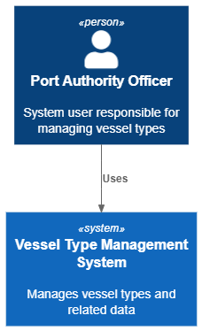
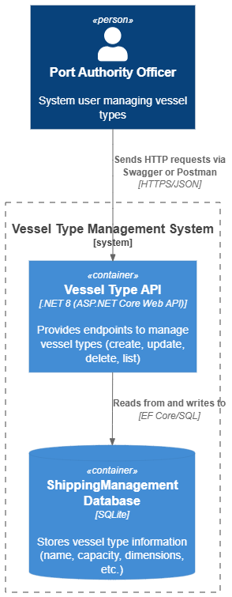

# US 2.2.1

## 1. Context

*As a Port Authority Officer, I want to create and update vessel types, so that vessels can be classified consistently and their operational constraints are properly defined.*

## 2. Requirements

**US 2.2.1** As a Port Authority Officer, I want to create and update vessel types.

**Acceptance Criteria:**

- Vessel types must include attributes such as name, description, capacity, and operational constraints (e.g.: maximum number of rows, bays, and tiers).

- Vessel types must be available for reference when registering vessel records.

- Vessel types must be searchable and filterable by name and description.

**Dependencies/References:**

*There no dependecies.*

**Forum Insight:**

* Still no questions related to this user story on forum.

## 3. Analysis

Vessel type Registration

## 4. C4 Model

#### Context - Level 1

#### Containers - Level 2

#### Components - Level 3

#### Code - Level 4

