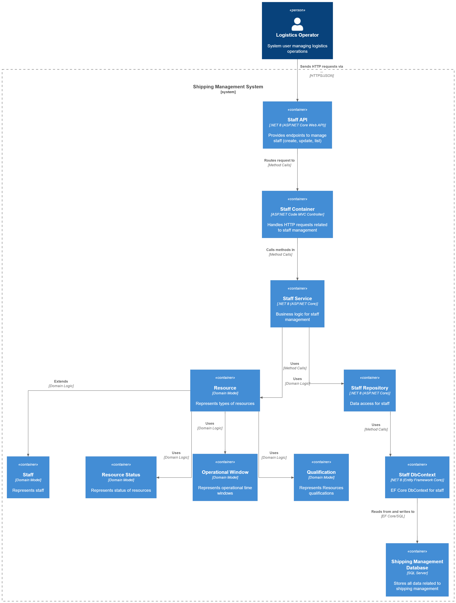
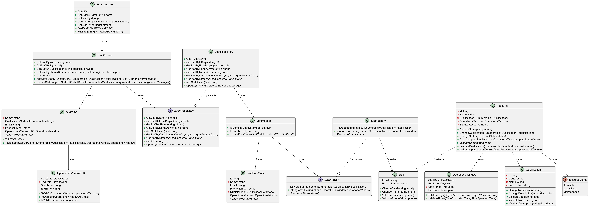
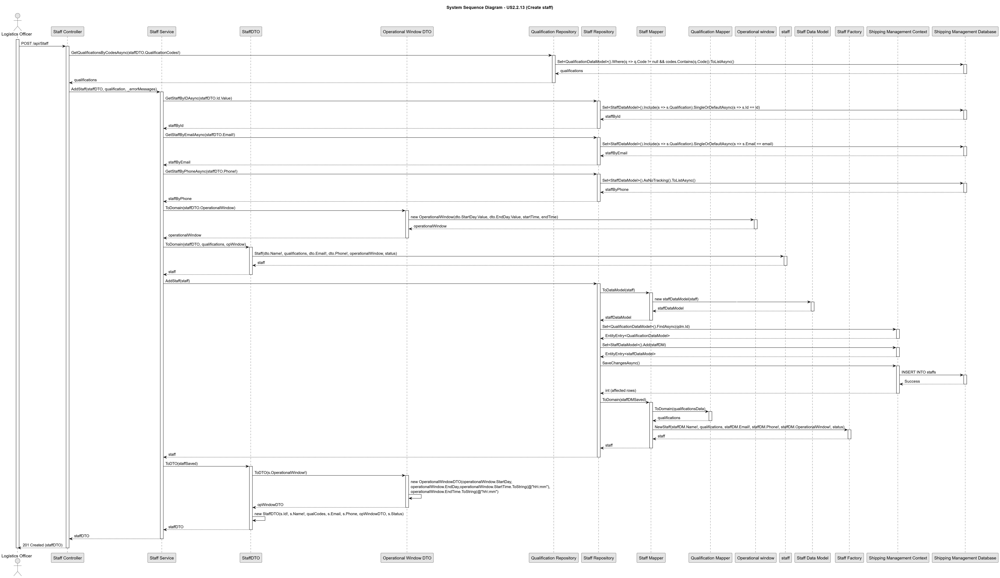

# US 2.2.11

## 1. Context

*Since many resources cannot function autonomously, the system must incorporate operating staff management information to support realistic scheduling and allocation. 
Despite their identification and contact data such as the mecanographic number, short name, email and phone, it is necessary to capture: Operations Window, Qualification, Current Status.*

## 2. Requirements

**US 2.2.11** As a Logistics Operator, I want to register and manage operating staff members (create, update, deactivate), so that the system can accurately reflect staff availability and ensure that only qualified personnel are assigned to resources during scheduling.

**Acceptance Criteria:**

- Each staff member must have a unique mecanographic number (ID), short name, contact details (email, phone),  qualifications, operational window, and current status (e.g., available, unavailable).

- Deactivation/reactivation must not delete staff data but preserve it for audit and historical planning purposes.

- Staff members must be searchable and filterable by id, name, status, and qualifications.

- To update or deactivate a staff member the system must guarantee a staff member is already registered in the system

**Dependencies/References:**

*There is no dependencies associated to this US.*

**Forum Insight:**

>> In US 2.2.11, the process of updating a staff member is mentioned. With the introduction of this action, a few questions have arisen:
When updating a staff member, can all previously entered information be modified?
Is it possible to leave a staff member’s record incomplete — for example, register some information now and complete the rest later — given that this could occur with the update action?
When a staff member is registered, do they automatically become available (with the status "available" )?
> 
> The mecanographic number cannot be modified. Everything else might be modified.
When registering a staff member, (s)he must be, by default, available.
Mandatory information comprehends, the mecanographic number , short name, contacts and status.

>>Just to clarify, if some information (outside the mandatory) is missing at registration because it will be provided later, should the staff member be marked as "available" or "unavailable"?
>
>The user - logistic operator - may choose.
Notice that, for instance, if the operational window is not specified, latter (on another US) the system will not be able to assign task to this staff member.

>>Como é que nós representamos a operational window? Ou seja, Temos uma disponibilidade do trabalhador e os turnos são calculados daí, ou temos os turnos já definidos que os trabalhadores fazem, e a operational window é logo calculada a partir daí?
>
>Bem, há diferentes formas (técnicas) de representação. Adotem a que for mais interessante...
Exemplos da informação a capturar pode ajudar à decisão.
Exemplo 1:\
. 2º feira: das 7h00 às 10h00; das 10h30 às 13h30; das 15h00 às 18h00;\
. 3º feira: das 7h00 às 10h00; das 10h30 às 13h30; das 15h00 às 18h00;\
. 4º feira: das 09h30 às 12h30; das 14h00 às 17h00;\
. 5º feira: das 14h00 às 17h00; das 17h30 às 20h30;\
. 6º feira: das 14h00 às 17h00; das 17h30 às 20h30;\
. Sábado: das 09h30 às 12h30;\
. Domingo: n/d;\
Exemplo 2:\
. 2º feira: das 13h00 às 17h00; das 18h00 às 21h00;\
. 3º feira: das 13h00 às 17h00; das 18h00 às 21h00;\
. 4º feira: n/d;\
. 5º feira: das 13h00 às 17h00; das 18h00 às 21h00;\
. 6º feira: das 13h00 às 17h00; das 18h00 às 21h00;\
. Sábado: das 13h00 às 17h00; das 18h00 às 21h00;\
. Domingo: n/d;\

## 3. Analysis

Record Registration

Record Update

.png)

Record Deactivation

.png)

## 4. C4 Model

#### Context - Level 1

#### Containers - Level 2

#### Components - Level 3

#### Code - Level 4

#### Level +1

Qualification POST

Qualification UPDATE
