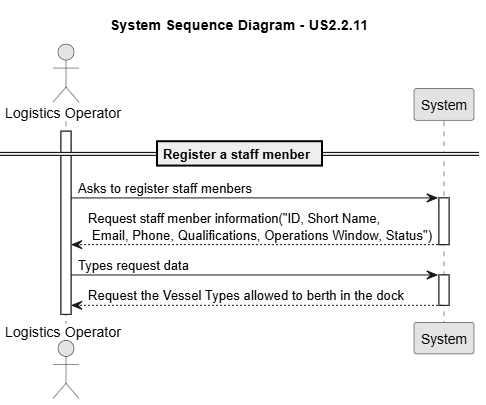

# US 2.2.11

## 1. Context

*Since many resources cannot function autonomously, the system must incorporate operating staff management information to support realistic scheduling and allocation. 
Despite their identification and contact data such as the mecanographic number, short name, email and phone, it is necessary to capture: Operations Window, Qualification, Current Status.*

## 2. Requirements

**US 2.2.3** As a Logistics Operator, I want to register and manage operating staff members (create, update, deactivate), so that the system can accurately reflect staff availability and ensure that only qualified personnel are assigned to resources during scheduling.

**Acceptance Criteria:**

- Each staff member must have a unique mecanographic number (ID), short name, contact details (email, phone),  qualifications, operational window, and current status (e.g., available, unavailable).

- Deactivation/reactivation must not delete staff data but preserve it for audit and historical planning purposes.

- Staff members must be searchable and filterable by id, name, status, and qualifications.

- To update or deactivate a staff member the system must guarantee a staff member is already registered in the system

**Dependencies/References:**

*There is no dependencies associated to this US.*

**Forum Insight:**

>> In US 2.2.11, the process of updating a staff member is mentioned. With the introduction of this action, a few questions have arisen:
When updating a staff member, can all previously entered information be modified?
Is it possible to leave a staff member’s record incomplete — for example, register some information now and complete the rest later — given that this could occur with the update action?
When a staff member is registered, do they automatically become available (with the status "available" )?
> 
> The mecanographic number cannot be modified. Everything else might be modified.
When registering a staff member, (s)he must be, by default, available.
Mandatory information comprehends, the mecanographic number , short name, contacts and status.

## 3. Analysis

Record Registration

Record Update

.png)

Record Deactivation

.png)