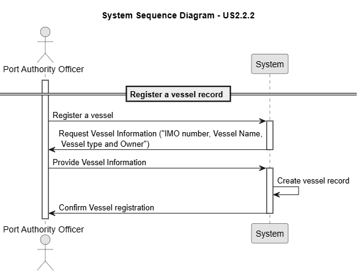
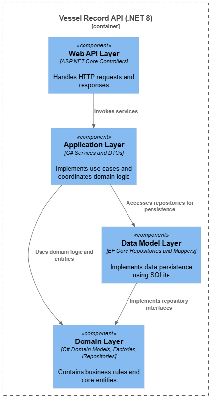
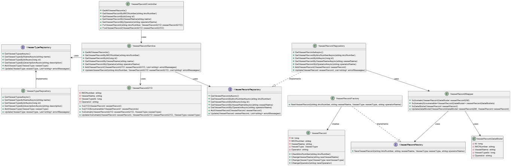
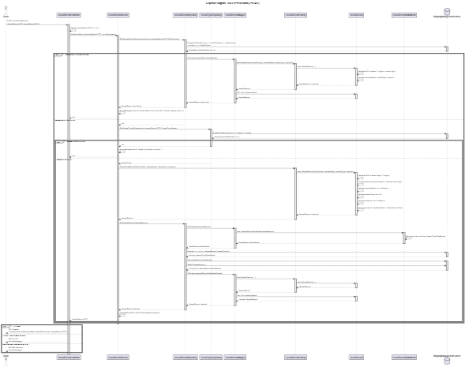
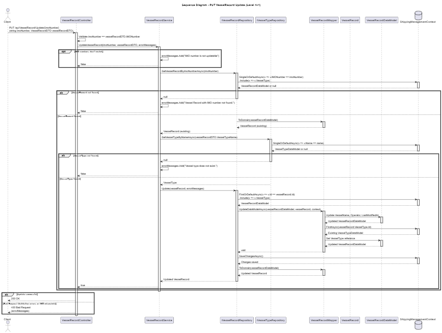

# US 2.2.2

## 1. Context

*As a Port Authority Officer, I want to register and update vessel records, so that valid vessels can be referenced in visit notifications.*

## 2. Requirements

**US 2.2.2** As a Port Authority Officer, I want to register and update vessel records.

**Acceptance Criteria:**

- Each vessel record must include key attributes such as IMO number, vessel name, vessel type and operator/owner.

- The system must validate that the IMO number follows the official format (seven digits with a check digit), otherwise reject it.


- Vessel records must be searchable by IMO number, name, or operator.


**Dependencies/References:**

*There is a dependency with US2.2.1, since a vessel type must exist so it can be assigned on the record.*


**Forum Insight:**

* No clarifications worth mention from the forum.

## 3. Analysis

Record Registration




## 4. C4 Model

#### Context - Level 1


#### Containers - Level 2


#### Components - Level 3



#### Code - Level 4




#### Level +1

##### Vessel Record POST


##### Vessel Record UPDATE


## 5. Integration Tests

### Tests Related to Post

```csharp
        [Fact]
        public async Task PostVesselRecord_CreatesSuccessfully()
        {
            var newVesselRecord = new VesselRecordDTO
            {
                IMONumber = "9876543",
                VesselName = "New Vessel",
                VesselTypeName = "Teste1",
                Operator = "New Operator"
            };

            var postResponse = await _client.PostAsJsonAsync("/api/VesselRecord", newVesselRecord);
            Assert.Equal(HttpStatusCode.Created, postResponse.StatusCode);

            var createdRecord = await postResponse.Content.ReadFromJsonAsync<VesselRecordDTO>();
            Assert.NotNull(createdRecord);
            Assert.Equal(newVesselRecord.IMONumber, createdRecord.IMONumber);
            Assert.Equal(newVesselRecord.VesselName, createdRecord.VesselName);
            Assert.Equal(newVesselRecord.VesselTypeName, createdRecord.VesselTypeName);
            Assert.Equal(newVesselRecord.Operator, createdRecord.Operator);
        }

        [Theory]
        [InlineData("1234567", "Valid Name", "Vessel Type 1", "Valid Operator")] // Duplicate IMO number
        [InlineData("123456", "Valid Name", "Vessel Type 1", "Valid Operator")] // IMO number too short
        [InlineData("12345678", "Valid Name", "Vessel Type 1", "Valid Operator")] // IMO number too long
        [InlineData("12345A7", "Valid Name", "Vessel Type 1", "Valid Operator")] // IMO number with non-digit
        [InlineData("9074729", "", "Vessel Type 1", "Valid Operator")] // Empty vessel name
        [InlineData("9074729", "Valid Name", "", "Valid Operator")] // Empty vessel type
        [InlineData("9074729", "Valid Name", "Vessel Type 1", "")] // Empty operator
        [InlineData("9074729", "Valid Name", "Vessel Type 1", "Valid Operator")] // Invalid IMO number (check digit)
        public async Task PostVesselRecord_InvalidData_ReturnsBadRequest(string imoNumber, string vesselName, string vesselTypeName, string operatorName)
        {
            var newVesselRecord = new VesselRecordDTO
            {
                IMONumber = imoNumber,
                VesselName = vesselName,
                VesselTypeName = vesselTypeName,
                Operator = operatorName
            };

            var postResponse = await _client.PostAsJsonAsync("/api/VesselRecord", newVesselRecord);
            Assert.Equal(HttpStatusCode.BadRequest, postResponse.StatusCode);
        }
```


### Tests Related to Update


```csharp

        [Theory]
        [InlineData("9811000", "New Vessel Name", "Teste1", "New Operator")]
        [InlineData("9241061", "Another Vessel Name", "Teste2", "Another Operator")]
        public async Task PutVesselRecord_UpdatesSuccessfully(string imoNumber, string newVesselName, string newVesselTypeName, string newOperator)
        {
            var response = await _client.GetAsync($"/api/VesselRecord/ByIMONumber/{imoNumber}");
            response.EnsureSuccessStatusCode();
            var vesselRecord = await response.Content.ReadFromJsonAsync<VesselRecordDTO>();
            Assert.NotNull(vesselRecord);

            vesselRecord.VesselName = newVesselName;
            vesselRecord.VesselTypeName = newVesselTypeName;
            vesselRecord.Operator = newOperator;

            var putResponse = await _client.PutAsJsonAsync($"/api/VesselRecord/Update/{imoNumber}", vesselRecord);
            Assert.Equal(HttpStatusCode.OK, putResponse.StatusCode);

            var getUpdatedResponse = await _client.GetAsync($"/api/VesselRecord/ByID/{vesselRecord.Id}");
            if (getUpdatedResponse.StatusCode != HttpStatusCode.OK)
            {
                var errorContent = await getUpdatedResponse.Content.ReadAsStringAsync();
                throw new Xunit.Sdk.XunitException($"Failed to retrieve updated vessel record. Status Code: {getUpdatedResponse.StatusCode}, Content: {errorContent}");
            }
            var returned = await getUpdatedResponse.Content.ReadFromJsonAsync<VesselRecordDTO>();
            Assert.NotNull(returned);
            Assert.Equal(newVesselName, returned.VesselName);
            Assert.Equal(newVesselTypeName, returned.VesselTypeName);
            Assert.Equal(newOperator, returned.Operator);
        }


                [Theory]
        [InlineData("123456", "Valid Name", "Teste1", "Valid Operator")] // IMO number too short
        [InlineData("12345678", "Valid Name", "Teste1", "Valid Operator")] // IMO number too long
        [InlineData("12345A7", "Valid Name", "Teste1", "Valid Operator")] // IMO number with non-digit
        [InlineData("1234567", "", "Teste1", "Valid Operator")] // Empty vessel name
        [InlineData("1234567", "Valid Name", "", "Valid Operator")] // Empty vessel type
        [InlineData("1234567", "Valid Name", "Teste1", "")] // Empty operator
        [InlineData("1234560", "Valid Name", "Teste1", "Valid Operator")] // Invalid IMO number (check digit)
        public async Task PutVesselRecord_InvalidData_ReturnsBadRequest(string imoNumber, string vesselName, string vesselTypeName, string operatorName)
        {
            var response = await _client.GetAsync($"/api/VesselRecord/imo/{imoNumber}");
            VesselRecordDTO vesselRecord;
            if (response.StatusCode == HttpStatusCode.OK)
            {
                vesselRecord = await response.Content.ReadFromJsonAsync<VesselRecordDTO>() ?? new VesselRecordDTO();
            }
            else
            {
                vesselRecord = new VesselRecordDTO
                {
                    IMONumber = imoNumber
                };
            }

            vesselRecord.VesselName = vesselName;
            vesselRecord.VesselTypeName = vesselTypeName;
            vesselRecord.Operator = operatorName;

            var putResponse = await _client.PutAsJsonAsync($"/api/VesselRecord/Update/{imoNumber}", vesselRecord);
            Assert.Equal(HttpStatusCode.BadRequest, putResponse.StatusCode);
        }
```