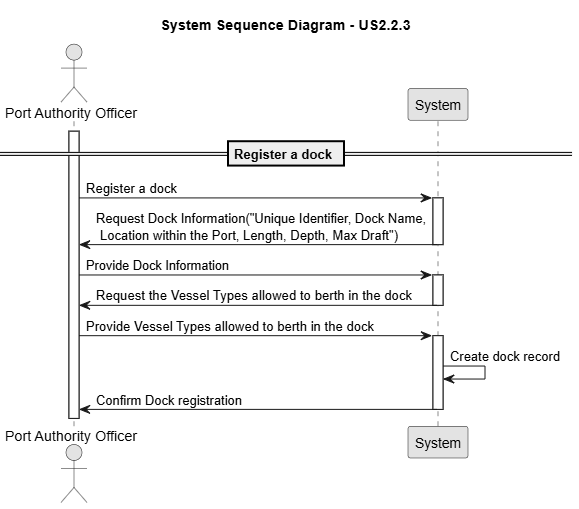

# US 2.2.3

## 1. Context

*Ports operate with multiple docks that accommodate vessels of different sizes and characteristics. To ensure proper port management, the system must allow the registration and update of dock information, including their identifiers, physical characteristics, and the vessel types they support.*

## 2. Requirements

**US 2.2.3** As a Port Authority Officer, I want to register and update docks, so that the system accurately reflects the docking capacity of the port.

**Acceptance Criteria:**

- A dock record must include a unique identifier, name/number, location within the port, and physical characteristics (e.g., length, depth, max draft).

- The officer must specify the vessel types allowed to berth there.

- Docks must be searchable and filterable by name, vessel type, and location.

**Dependencies/References:**

*There is a dependency with US2.2.1, since a vessel type must exist so it can be assigned on the record.*

**Forum Insight:**

>> Regarding this user story, can you confirm if a dock supports only one vessel type?
> 
> No! That is clearly wrong. An acceptance criteria states that "The officer must specify the vessel types allowed to berth there.". On a given dock may berth several vessel types (e.g. Feeder and Panamax).

## 3. Analysis

Record Registration

