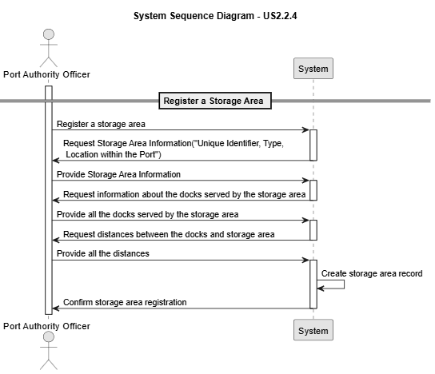

# US 2.2.4

## 1. Context

*The Port Authority needs to maintain accurate and up-to-date information about storage areas within the port to ensure efficient allocation of (un)loading and storage operations. Each storage area must be clearly identified and characterized by its type, location, and capacity, since this information directly impacts operational planning.*

## 2. Requirements

**US 2.2.4** As a Port Authority Officer, I want to register and update storage areas, so that (un)loading and storage operations can be assigned to the correct locations.

**Acceptance Criteria:**

- Each storage area must have a unique identifier, type (e.g., yard, warehouse), and location within the port.

- Storage areas must specify maximum capacity (in TEUs) and current occupancy.

- By default, a storage area serves the entire port (i.e., all docks). However, some storage areas (namely yards) may be constrained to serve only a few docks, usually the closest ones.

- Complementary information, such as the distance between docks and storage areas, must be manually recorded to support future logistics planning and optimization.

- Updates to storage areas must not allow the current occupancy to exceed maximum capacity.

**Dependencies/References:**

*There are no dependencies with other US's.*

**Forum Insight:**

>> My question is if the distance that he must insert is to all the docks., it means, if the port has 5 docks he must insert 5 distances?
> 
> If the storage area serves all docks, you need to know those distances.

>> Other question is if it's necessary to keep the distance between storage areas.
> 
> By the moment, that is not necessary.

## 3. Analysis

Record Registration

