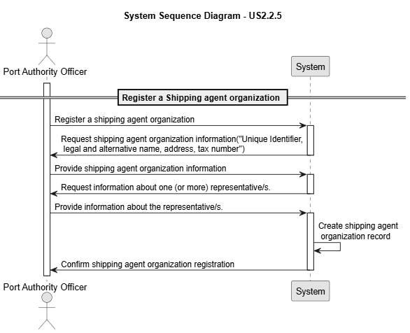

# US 2.2.5

## 1. Context

*Shipping agents are essential stakeholders in port operations, acting as intermediaries between shipping companies and the port authority. In order to grant them access to the port’s digital system, it is necessary to register their organizations and representatives.*

## 2. Requirements

**US 2.2.5** As a Port Authority Officer, I want to register new shipping agent organizations, so that they can operate within the port’s digital system.

**Acceptance Criteria:**

- Each organization must have at least an identifier, legal and alternative names, an address, its tax number.

- Each organization must include at least one representative at the time of registration.

- Representatives must be registered with name, citizen ID, nationality, email, and phone number. Email and phone number are used for system notifications, including approval decisions and the authentication process.

**Dependencies/References:**

*There are no dependencies with other US's.*

**Forum Insight:**

Still no questions asked about the US'S.

## 3. Analysis

Record Registration

