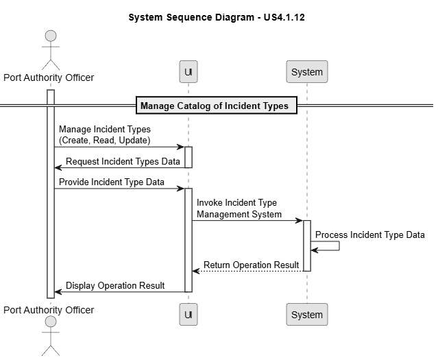
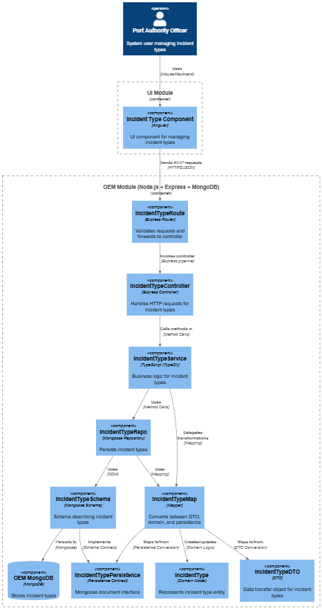
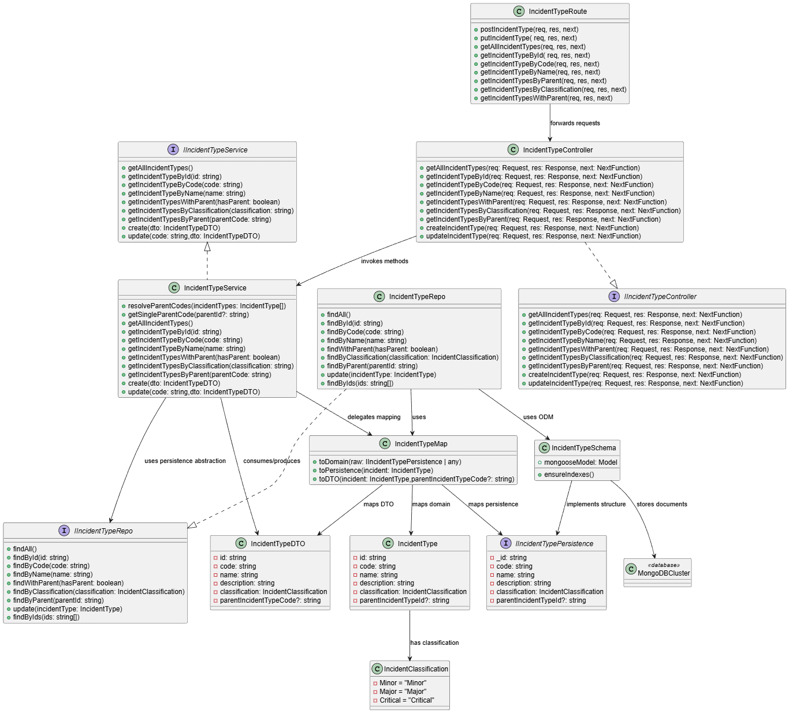

# US 4.1.12

## 1. Context

*This user story focuses on ensuring standardized and consistent classification of operational incidents by enabling Port Authority Officers to manage a structured catalog of Incident Types. The system must support a hierarchical model, allowing incident types to be organized under parent categories for clearer grouping, filtering, and analysis.*

## 2. Requirements

**US 4.1.12** As a Port Authority Officer, I want to manage the catalog of Incident Types so that the classification of operational disruptions remains standardized, hierarchical, and clearly distinct from complementary tasks.

**Acceptance Criteria:**

- The system must support hierarchical structuring of incident types (e.g., Fog is a subtype of Environmental Conditions), allowing grouping and filtering by parent type.

- CRUD operations for Incident Types must be available via the REST API.

- The SPA must provide an intuitive interface for listing, filtering, and managing these hierarchy of types. 

- Each Incident Type must include a unique code (e.g., T-INC001), a name (e.g., Equipment Failure), a detailed description, a severity classification (e.g., Minor, Major, Critical).

- Examples of possible types: Environmental Conditions: Fog, Strong Winds, Heavy Rain; Operational Failures: Crane Malfunction, Power Outage; Safety/Security Events: Security Alert

**Dependencies/References:**

*There are no dependencies in this User Story!*


**Forum Insight:**

>> Is it possible for Port Authority Officer to update any field after creating an Incident Type?
> 
> Yes, excepting the unique code.

>> No enunciado é mencionado que tanto os Incident Types quanto as Complementary Task Categories possuem “unique codes”, e que os Incidents e as Complementary Tasks têm um “unique generated ID”. Existe algum formato específico para esses códigos? Se sim, quais são as regras? Se possível, gostaria também de ver alguns exemplos.
> 
> Quanto aos "códigos unicos" dos tipos de incidentes como das categorias de tarefas complementares, estes são códigos alfa-numéricos introduzidos (máx. 10 caracteres) pelos utilizadores. Nas respetivas US já constam alguns exemplos.

>> Os tipos de incidentes serão por exemplo, Fog com um determinando grau de severidade, ou o tipo de incidente refere-se ao facto de ser um Environmental Conditions?
> 
> Sim, "Fog" é um tipo de incidente. Como "Environmental Conditions" pode ser outro tipo de incidente. E neste caso, existindo os dois tipos de incidentes, provavelmente "Fog" será registado como sub-tipo de "Environmental Conditions". Aliás isto consta na US 4.1.12 desta forma "e.g., Fog is a subtype of Environmental Conditions".

## 3. Analysis

Manage Catalog of Incident Types



## 4. C4 Model

#### Components - Level 3



#### Code - Level 4




## 5. Tests

### System (end-to-end)
- [OEM/tests/system/IncidentType.system.test.ts](OEM/tests/system/IncidentType.system.test.ts) spins up the real Express stack against MongoDB Atlas and exercises full CRUD, duplicate protection, parent-child linkage, filtering (classification/hasParent), and update flows to guarantee the deployed application behaves correctly across all layers.

```ts
describe("POST /incident-types", () => {
  it("should create and retrieve an incident type from real database", async () => {
    const payload = {
      code: "SYS1",
      name: "System Test",
      description: "Created in system test",
      classification: "Minor"
    };

    const createRes = await request(app)
      .post("/api/incident-types")
      .send(payload);

    expect(createRes.status).toBe(201);
    expect(createRes.body.code).toBe("SYS1");

    const getRes = await request(app).get("/api/incident-types/code/SYS1");

    expect(getRes.status).toBe(200);
    expect(getRes.body.name).toBe("System Test");
  });

  it("should fail when creating duplicate code in database", async () => {
    const payload = {
      code: "DUP001",
      name: "Duplicate Test",
      description: "Testing duplicates",
      classification: "Minor"
    };

    await request(app).post("/api/incident-types").send(payload);

    const res = await request(app).post("/api/incident-types").send(payload);

    expect(res.status).toBe(400);
    expect(res.body.error).toContain("already exists");
  });
});
```

### Application (routes + controller)
- [OEM/tests/application/IncidentType.routes.test.ts](OEM/tests/application/IncidentType.routes.test.ts) mounts the genuine HTTP routes and controller with a mocked service, stressing Celebrate validation, authorization middleware, payload normalization, and error-to-status translation for every REST entrypoint (POST, PUT, and the various GET filters).

```ts
describe("IncidentType Routes (Application Tests)", () => {
  it("PUT /incident-types/update/:code → 400 when trying to change code", async () => {
    incidentTypeServiceMock.update.mockResolvedValue({
      isSuccess: false,
      isFailure: true,
      error: "IncidentType code cannot be changed.",
      errorValue: () => "IncidentType code cannot be changed."
    });

    const app = createTestApp();
    const res = await request(app)
      .put("/incident-types/update/INC1")
      .send({
        code: "INC999",
        name: "Updated",
        description: "Updated desc",
        classification: "Major"
      });

    expect(res.status).toBe(400);
    expect(res.body.error).toContain("cannot be changed");
  });
});
```

### Aggregate/Service
- [OEM/tests/aggregate/IncidentTypeAggregate.test.ts](OEM/tests/aggregate/IncidentTypeAggregate.test.ts) covers `IncidentTypeService` in isolation with an in-memory repository, validating business rules such as unique codes, immutable identifiers, parent resolution, classification filtering, and update guards before data reaches persistence.

```ts
describe("IncidentTypeService – Aggregate Tests", () => {
  it("should create a new IncidentType (full aggregate flow)", async () => {
    const dto = { code: "C100", name: "AAA", description: "DESC", classification: IncidentClassification.Minor };

    const result = await service.create(dto as any);

    expect(result.isSuccess).toBe(true);
    expect(await repo.findByCode("C100")).not.toBeNull();
  });

  it("should fail to create if code already exists", async () => {
    await repo.save(new IncidentType("1", "C100", "AAA", "D", IncidentClassification.Minor));

    const result = await service.create({
      code: "C100",
      name: "BBB",
      description: "D",
      classification: IncidentClassification.Major
    } as any);

    expect(result.isFailure).toBe(true);
    expect(result.errorValue()).toContain("already exists");
  });

  it("should block update when name already in use by another item", async () => {
    await repo.save(new IncidentType("1", "A", "AAA", "desc", IncidentClassification.Minor));
    await repo.save(new IncidentType("2", "B", "BBB", "desc", IncidentClassification.Minor));

    const result = await service.update("A", {
      code: "A",
      name: "BBB",
      description: "x",
      classification: IncidentClassification.Minor
    } as any);

    expect(result.isFailure).toBe(true);
    expect(result.errorValue()).toContain("already in use");
  });
});
```

### Unit (domain model)
- [OEM/tests/units/domain/IncidentType.test.ts](OEM/tests/units/domain/IncidentType.test.ts) targets the `IncidentType` aggregate root, asserting constructor invariants (non-empty fields, max code length) and the mutation methods (`updateName`, `updateDescription`, `updateClassification`, `updateParentIncidentType`) so domain rules remain enforced even without infrastructure.

```ts
describe("IncidentType (unit tests)", () => {
  const validData = {
    id: "1",
    code: "CODE1",
    name: "Test Incident",
    description: "A valid incident",
    classification: IncidentClassification.Minor
  };

  it("should throw error if code exceeds 10 characters", () => {
    expect(() =>
      new IncidentType(
        validData.id,
        "12345678901",
        validData.name,
        validData.description,
        validData.classification
      )
    ).toThrow("Incident type code cannot exceed 10 characters.");
  });

  it("should update name with a valid value", () => {
    const incident = new IncidentType(
      validData.id,
      validData.code,
      validData.name,
      validData.description,
      validData.classification
    );

    incident.updateName("Updated Name");
    expect(incident.name).toBe("Updated Name");
  });

  it("should throw error when updating description with empty value", () => {
    const incident = new IncidentType(
      validData.id,
      validData.code,
      validData.name,
      validData.description,
      validData.classification
    );

    expect(() => incident.updateDescription("")).toThrow(
      "Incident type description cannot be null or empty."
    );
  });
});
```

