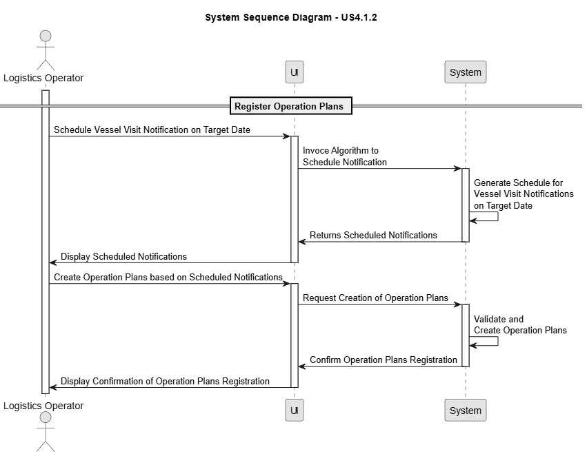
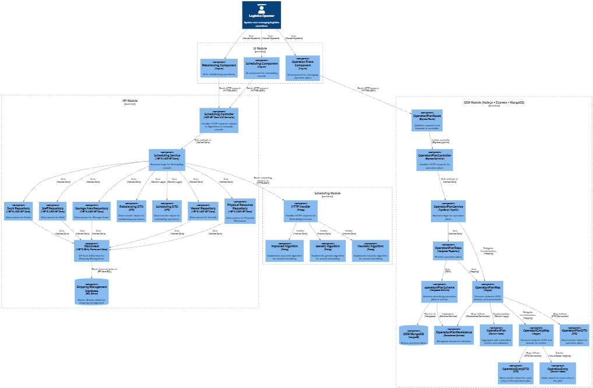
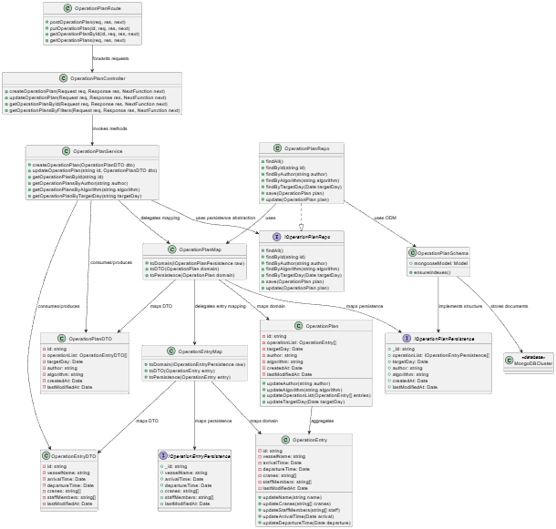

# US 4.1.2

## 1. Context

*To support efficient and well-coordinated cargo operations, the system must be capable of automatically producing detailed Operation Plans for all Vessel Visit Notifications (VVNs) scheduled on a given day. These plans are generated by the Planning & Scheduling module using configurable scheduling algorithms and are intended to provide a structured, time-aware view of all loading and unloading activities associated with each vessel visit. An Operation Plan captures not only the sequence and possible parallelism of operations, but also the allocation of physical and human resources to each operation, along with planned start and end times that account for operational constraints such as resource availability or planned pauses.*

## 2. Requirements

**US 4.1.2** As a Logistics Operator, I want to automatically generate and store Operation Plans for all Vessel Visit Notifications (VVNs) scheduled for a given day using one of the available scheduling algorithms, so that cargo operations are efficiently organized and can later be monitored or adjusted.

**Acceptance Criteria:**

- The operator must be able to select a target day for which Operation Plans will be generated.

- Operation Plans are generated by the Planning & Scheduling module, using the selected algorithm:

- An Operation Plan aggregates all the (sequence of) operations related to a VVN.

- Each plan must include, among others, the assigned resources, planned time windows for loading/unloading.

- The SPA must allow operators to initiate and view generated plans before saving them in the OEM module.

- For auditability purposes, the system must record some metadata such as creation date, author, algorithm used.

**Dependencies/References:**

*There no dependecies.*

**Forum Insight:**

>> Ao gerar um Operation Plan, duas das informações necessárias são os recursos a serem utilizados e os tempos para o carregamento e descarregamento de carga. Em relação aos tempos, é relevante identificar a que operação da sequência eles pertencem, considerando que as operações são unicamente “loading” e “unloading”? Uma das soluções pensadas foi colocá-los na mesma ordem em que as operações serão realizadas. E, em relação aos recursos, é necessário indicar a que operação pertencem?
> 
> Ao nível do planeamento de operações é importante saber/conhecer: 
>1. A sequência / ordem de cada operação. E.g., descarregar contentor X, depois o Y e depois o Z;... carregar o contentor K, depois o M, etc... 
1.1. Devem ter em atenção que é possível executar operações em simultâneo. E.g., se num cais existem 2 gruas, cada uma pode (des)carregar ao mesmo tempo um contentor.
1.2. Também devem considerar que pode haver paragens entre operações sequenciais, por exemplo, devido a indisponibilidade de recursos humanos. Nesse sentido, definir a hora inicio/fim previsto de cada operação é importante.
>2. Os recursos (físicos e humanos) envolvidos em cada operação, de modo a permitir, por exemplo, discriminar:
2.1. Que a grua G1 descarrega o contentor H enquanto a grua G2 descarrega o contentor P.
2.2. Que a grua G1 está a ser operada pelo Manuel até às 16h00 mas que daí em diante, até às 23h00, é a Carla que realizar as operações planeadas para essa mesma grua.
>Seja qual for a estrutura de informação adotada, o sistema deveria ser capaz de dar resposta a estas necessidades.

## 3. Analysis

Operation Plan Registration

## 4. C4 Model

#### Components - Level 3

#### Code - Level 4

## 5. Tests

