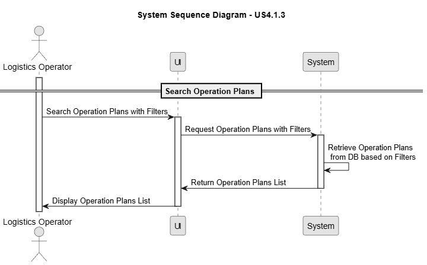
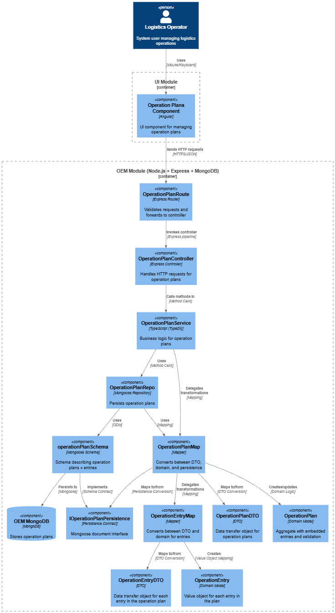
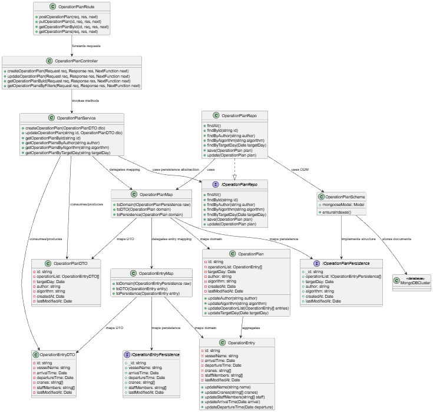

# US 4.1.3

## 1. Context

*This user story focuses on enabling Logistics Operators to efficiently review scheduled Operation Plans within a specific day or time period. By providing search, filter, and sorting capabilities through a REST API and a SPA interface, operators can quickly identify relevant plans based on date ranges and vessel identifiers, improving visibility and operational planning.*

## 2. Requirements

**US 4.1.3** As a Logistics Operator, I want to search and list Operation Plans for a given day or period, so that I can quickly review all scheduled activities within that timeframe.

**Acceptance Criteria:**

- The REST API must support querying Operation Plans by date range and/or vessel identifier.

- The SPA must provide a searchable and filterable table showing plan summaries (e.g., vessel, dock, start/end time, assigned resources).

- Results must be sortable (e.g., by start time, vessel name, or expected delay).

**Dependencies/References:**

*This user story depends on US4.1.2 because to be able to search for Operation plans, they already must be created.*

**Forum Insight:**

*There are no forum insights related to this User Story!*

## 3. Analysis

Operation Plan Search

## 4. C4 Model

#### Components - Level 3

#### Code - Level 4

## 5. Tests

