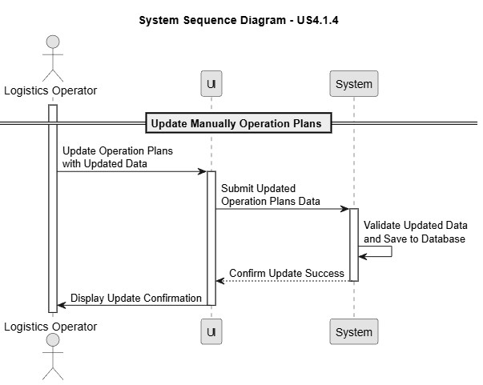
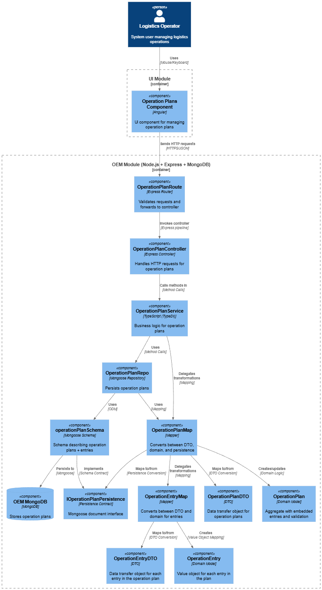
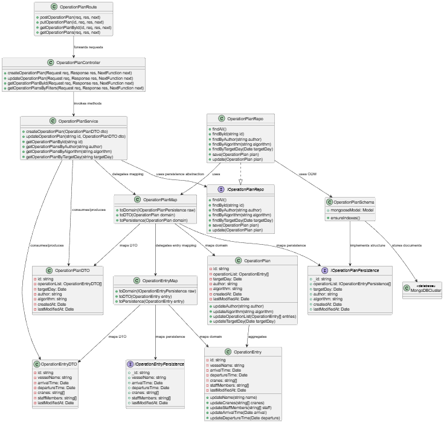

# US 4.1.4

## 1. Context

*This user story addresses the need for operational flexibility in logistics planning, enabling Logistics Operators to manually update an existing Operation Plan for a given VVN when last-minute changes occur. Through dedicated REST API update endpoints and an editable SPA interface, operators can adjust critical planning elements such as crane allocation, scheduling, and staff assignment.*

## 2. Requirements

**US 4.1.4** As a Logistics Operator, I want to manually update the Operation Plan of a given VVN, so that last-minute adjustments (e.g., resource or timing changes) can be made when needed.

**Acceptance Criteria:**

- The REST API must provide update endpoints.

- The SPA must allow editing key plan fields (e.g., crane assignment, start/end time, staff).

- Changes must be validated and logged (date, author, reason for change).

- The system must alert the user if the updated plans introduce possible inconsistencies with related VVNs and resource availability (e.g., cranes or staff).

**Dependencies/References:**

*This user story depends on US4.1.2 because to be able to update Operation plans, they already must be created.*

**Forum Insight:**

*There are no forum insights related to this User Story!*

## 3. Analysis

Operation Plan Update

## 4. C4 Model

#### Components - Level 3

#### Code - Level 4

## 5. Tests

