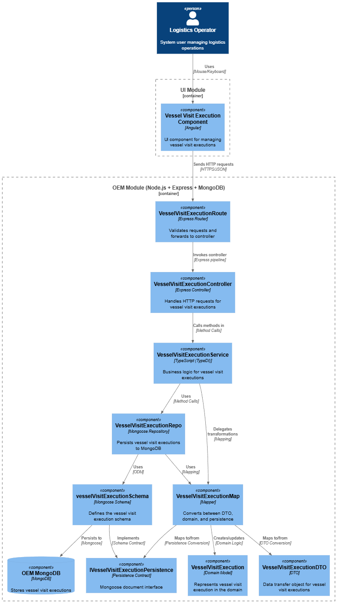
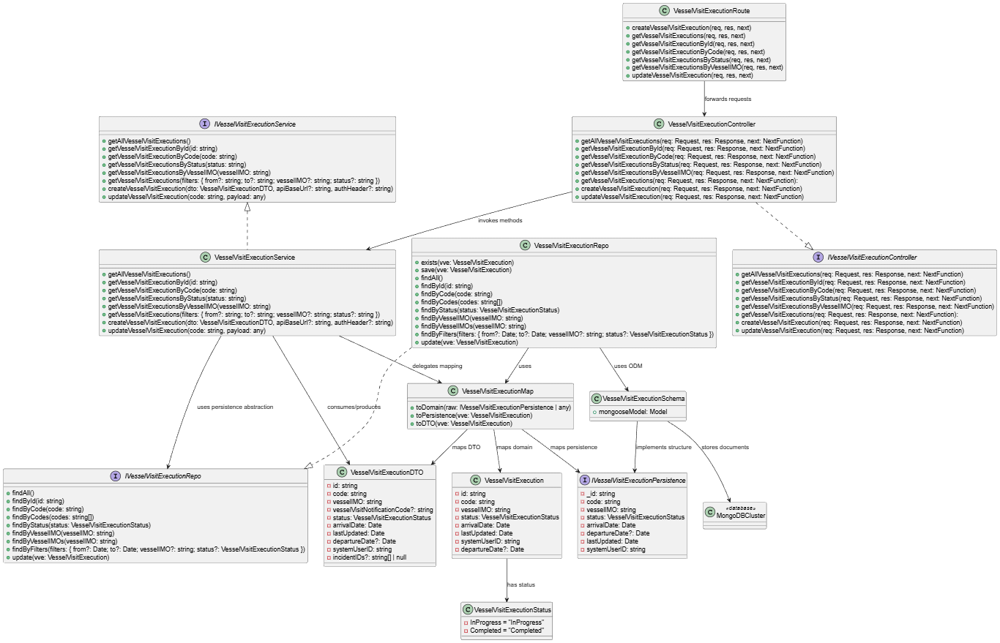

# US 4.1.8

## 1. Context

*This user story addresses the need to accurately deefining the vessel's arrival time and its dock by allowing Logistics Operators to update a pending Vessel Visit Execution (VVE). Building on previously created executions (US4.1.7), the system enables operators to edit the actual berth date and its assigned dock.*

## 2. Requirements

**US 4.1.8** As a Logistics Operator, I want to update an in progress VVE with the
actual berth time and dock used, so that discrepancies from the planned
dock assignment are recorded.

**Acceptance Criteria:**

-  The REST API must support update of berth time and dock ID.

- If the assigned dock differs from the planned one, a warning or note must be automatically
added.

- All updates must be timestamped and logged for auditability.

**Dependencies/References:**

*This user story depends on US4.1.7 because to be able to update Vessel Visit Executions, they already must be created.*

**Forum Insight:**

*No relevant observations were made.*

## 3. Analysis

Vessel Visit Execution Update

## 4. C4 Model

#### Components - Level 3

#### Code - Level 4

## 5. Tests

